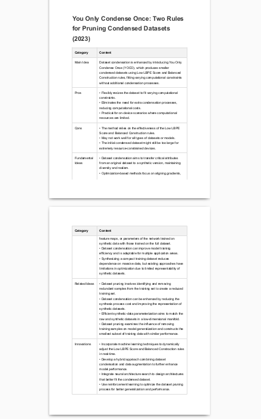

# ML Reviewer

**ML Reviewer** leverages Hugging Face's [smolagents](https://github.com/huggingface/smolagents) framework to automatically construct a review report of state‐of‐the‐art (SOTA) research (as a pdf file) in a specified machine learning topic. The report highlights the following categories for each paper:

- **Title**: `paper["title"]`
- **Year**: `paper["year"]`
- **Main Idea**: `main_idea`
- **Pros**: `pros` ( A list of technical advantages (at least 3) of the approach.)
- **Cons**: `cons` (A list of technical flaws (at least 3))
- **Fundamental Ideas**: `fundamental_ideas` (Core techniques or concepts in the approach)
- **Related Ideas**: `related_ideas` (Similar techniques or ideas found in the literature)
- **Innovations**: `innovations` (new ideas that can improve upon the cons)

---

## Setup

**Platform**: Ubuntu

```bash
chmod +x env.sh
chmod +x review.sh  <topic of ML>  <number of papers>

# Setup conda environment
./env.sh

# Run reviewer
./review.sh

```


## Sample Output on Topic "Dataset Condensation":

